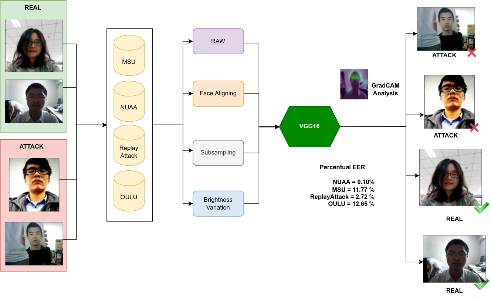

# IEEE_Transfer-learning-for-face-anti-spoofing-detection
Code and Jupyter notebooks for the paper "Transfer learning for face anti-spoofing detection." Published in IEEE Latin America.

The purpose of this repository is to share some of the notebooks used for preprocessing and experimenting with the data used in the paper. The image below details the anti-spoofing detection flow used in this paper.

## Datasets

This paper experimented with four different datasets. These datasets are widely used in the face-anti-spoofing field. The datasets used and the link to obtain them are detailed below:

* [NUAA](https://www.scinapse.io/papers/1889383825)
* [MSU-MFSD](https://sites.google.com/site/huhanhomepage/datasetcode?authuser=0)
* [Replay Attack](https://www.idiap.ch/en/dataset/replayattack)
* [OULU-NPU](https://sites.google.com/site/oulunpudatabase/?pli=1)

## Models

This paper used the Keras framework for the training process. Models used to train the network can be found [here](https://keras.io/api/applications/).

## Face Detection

To extract face data from the images, we used a Dlib extractor. There is a python module available [here](https://pypi.org/project/dlib/).

## Data Analysis

To store and analyze the data of this paper, we used [Neptune](https://neptune.ai/).

## Notebooks

We also included notebooks used for the Preprocessing, Experimentation:

* The Preprocessing notebook details the handling of the training data and the preprocessing techniques used.

* The Experimentation notebook details the training process and the experiments made throughout this paper.

## Python Scripts

We also provided our pythons scripts used for processing the dataset frames, data loading, face alignment and face_extraction.
